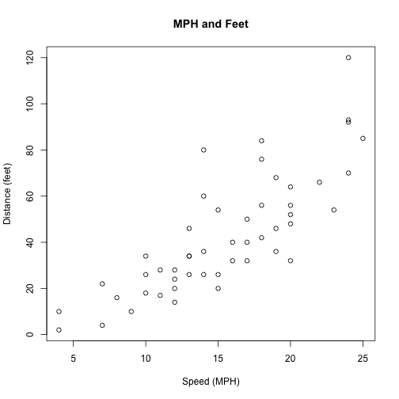
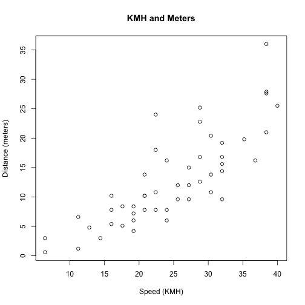

Final Group Presentation Template
========================================================
author: Student Name1, Student Name2
date: "2018-09-13"
autosize: true
<br>


The Problem
========================================================
autosize: true
We are interested in public safety. Specifically, we focused on traffic flow.

- Speed of Car
- Distance to Stop

How the data was imported? 
========================================================
autosize: true


Data is located in `datasets`.  No need to import.
========================================================
autosize: true

- The data has two vectors with 50 rows. 
- The two vectors are speed (mph) and dist (feet) which are both numeric.


```r
str(cars)
```

```
'data.frame':	50 obs. of  2 variables:
 $ speed: num  4 4 7 7 8 9 10 10 10 11 ...
 $ dist : num  2 10 4 22 16 10 18 26 34 17 ...
```

Data Wrangling and Transformations
========================================================
autosize: true


Convert from MPH and Feet to KMH and Meters
========================================================
autosize: true
- Converted miles per hour to kilometers per hour (1 to 1.6)
- Converted feet to meters (1 to .3)

```r
library(tidyverse)
cars2 <- cars %>% 
  dplyr::mutate(kmh = speed*1.6, meters = dist*.3 )
```

Data Wrangling and Transformations: Results
========================================================
autosize: true
- No wrangling; just transformation.

```r
head(cars2, n=5)
```

```
  speed dist  kmh meters
1     4    2  6.4    0.6
2     4   10  6.4    3.0
3     7    4 11.2    1.2
4     7   22 11.2    6.6
5     8   16 12.8    4.8
```

Numeric Summary of the data using `summarize`
========================================================
autosize: true

```r
summarize(cars2, mean(dist), mean(speed))
```

```
  mean(dist) mean(speed)
1      42.98        15.4
```


```r
summarize(cars2, mean(kmh), mean(meters))
```

```
  mean(kmh) mean(meters)
1     24.64       12.894
```


Visualize Data with GGPLOT
========================================================
autosize: true


Visualization of the Data by Metric
========================================================
autosize: true


***


How the data was modeled: Include equations
========================================================
autosize: true
<br>
- We used a linear regression
<br>
<br>
$$Y_i=\alpha+X_i\beta$$


Linear Regression: R Code
========================================================
autosize: true


```r
model1.lm <- lm(dist ~ speed, data = cars2)
```


```r
model2.lm <- lm(meters ~ kmh, data = cars2)
```

Results: MPH and Feet
========================================================
autosize: true

```r
library(arm)
display(model1.lm)
```

```
lm(formula = dist ~ speed, data = cars2)
            coef.est coef.se
(Intercept) -17.58     6.76 
speed         3.93     0.42 
---
n = 50, k = 2
residual sd = 15.38, R-Squared = 0.65
```

Results: KPH and Meters
========================================================
autosize: true

```r
library(arm)
display(model2.lm)
```

```
lm(formula = meters ~ kmh, data = cars2)
            coef.est coef.se
(Intercept) -5.27     2.03  
kmh          0.74     0.08  
---
n = 50, k = 2
residual sd = 4.61, R-Squared = 0.65
```

Standardize the Coefficients with `lm.beta`
========================================================
autosize: true

```r
library(lm.beta)
lm.beta(model.lm)
```

Results: They're the same!
========================================================
autosize: true
<br>

```

Call:
lm(formula = dist ~ speed, data = cars2)

Standardized Coefficients::
(Intercept)       speed 
  0.0000000   0.8068949 
```
***
<br>

```

Call:
lm(formula = meters ~ kmh, data = cars2)

Standardized Coefficients::
(Intercept)         kmh 
  0.0000000   0.8068949 
```

Summary:
========================================================
autosize: true
- For every mph increase in speed, the feet to stop increases by 3.93!
- Association is positive and strong.
- In the future, explore association with accidents!

Conclusions:
========================================================
autosize: true
- Follow the speed limit!


